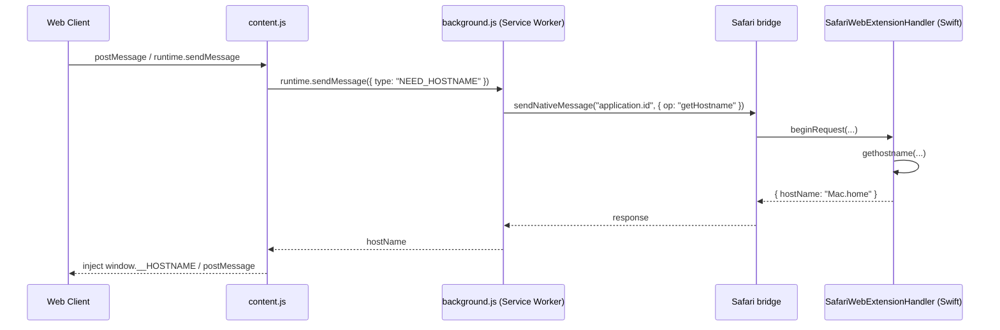

#  Hostname Bridge — Safari Web Extension (macOS)

Expose the machine’s **hostname** to web pages via a **Safari Web Extension**.


## ✨ How it works (overview)


                     
                     
> **Safari note:** on macOS, `sendNativeMessage` must use **`"application.id"`**. This is a special value Safari uses to route the message to **your App Extension** (Swift). There is no external EXE/registry host on Safari.

## ✅ Requirements

- **macOS 11.0+** (Big Sur or later)  
- **Xcode 14+** (15+ recommended)  
- **Safari 15+**  


## 🔌 Frontend integration (quick example)

**Simplest**: read the injected global and (optionally) persist it in your app’s `localStorage`.

```ts
// e.g., inside a service
getHostname(): string | null {
  const host = (window as any).__HOSTNAME ?? null;
  if (host) localStorage.setItem('HOSTNAME', host);
  return host;
}
```

**postMessage** variant (no injected script; the page listens and stores itself):
```ts
// request from the extension
window.postMessage({ type: 'NEED_HOSTNAME' }, '*');

// listen for the reply
window.addEventListener('message', (e: MessageEvent) => {
  if (e.data?.type === 'HOSTNAME') {
    if (e.data.value) localStorage.setItem('HOSTNAME', e.data.value);
  }
});
```
## 🧪 Debug tips

- Enable Develop menu: Safari → Settings → Advanced → Show Develop menu.
- Background console: Develop → Web Extension Background Content → Hostname Bridge.
- Open this inspector before triggering actions to keep the service worker alive.
- Wake the service worker: reloading a page that matches content_scripts.matches is enough (or send a message from the page).
- Privileged pages: no injection on system pages (New Tab, App Store, Preferences, etc.).


## Permissions & privacy

- Minimal permissions: "nativeMessaging", "storage", and restricted host permissions.
- The extension does not perform any network calls; it only reads the hostname and returns it to pages that ask for it.
- In production, restrict matches/host_permissions to your domains.
